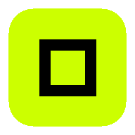

<div align="center">



# Calculator Led Pro

**Calculadora de campo para técnicos de pantallas LED.**

Decile qué pantalla necesitás y te devuelve cuántos gabinetes entran, cuánto pesa,
cuánta corriente consume, cuántos cables hacen falta y cómo rutearlos — con el
esquemático dibujado y el parte de trabajo en PDF.

<br>


<br>

### [🖥️ &nbsp; Abrir Calculator Led Pro](https://calculator-led-pro.netlify.app)

<sub>Gratis · Funciona sin señal · No hace falta instalar nada ni crear cuenta</sub>

</div>

---

## Qué es

Es la cuenta que hacés en el piso, antes de colgar una pantalla, hecha en el
teléfono en lugar de a mano en una libreta.

Elegís el modelo de gabinete, decís qué pantalla querés —**en metros o en
paneles**— y la app te devuelve todo lo que necesitás para armarla y para pedir el
material:

Cuántos gabinetes entran y en qué grilla. Cuánto mide y cuánto pesa en total. Qué
resolución da. Cuánta corriente consume y si tu alimentación aguanta. Cuántos
cables de data y de power hay que llevar. Cuántos procesadores. Y el **ruteo
dibujado sobre la grilla**, cable por cable, para que el equipo patchee mirando un
dibujo en vez de contando gabinetes con el dedo.

Después exportás todo en PDF y se lo pasás al rigger, al eléctrico o al cliente.

**Está pensada para el teléfono, en un venue oscuro, a un brazo de distancia y con
apuro.** Por eso es verde sobre negro: una app blanca en una sala a oscuras te
arruina la visión nocturna.

> [!WARNING]
> Los números son **cifras de planificación, no reemplazan a un electricista.**
> La app calcula con los datos que le cargás; si el gabinete o la instalación no
> son los que declaraste, el resultado tampoco lo es.

<br>

<div align="center">

|                                 |                                                                                         |
| ------------------------------- | --------------------------------------------------------------------------------------- |
| 📶 **Funciona sin señal**       | Se instala en el teléfono y anda con el modo avión puesto                               |
| ⚡ **Te avisa si te pasás**     | Si el consumo supera la alimentación, aparece una alarma imposible de ignorar           |
| 🔌 **Los mains salen del piso** | El ruteo automático arranca cada cable desde abajo, que es de donde sale en la realidad |
| ✏️ **Ruteo a mano**             | Si el automático no te sirve, dibujás vos el recorrido tocando gabinete por gabinete    |
| 💾 **No perdés el trabajo**     | Se guarda solo mientras escribís y vuelve como lo dejaste                               |
| 📄 **Parte de trabajo en PDF**  | Todas las tablas más los dos esquemáticos, listo para mandar                            |

</div>

---

## Contenido

**Para usar la app**

- [Cómo se usa](#cómo-se-usa)
- [Qué te dice](#qué-te-dice)
- [Cómo se lee el esquemático](#cómo-se-lee-el-esquemático)
- [Usarla sin internet](#usarla-sin-internet)
- [La letra chica de los números](#la-letra-chica-de-los-números)

**Para tocar el código**

- [Correr el proyecto](#correr-el-proyecto)
- [Cómo está armado](#cómo-está-armado)
- [Decisiones de diseño](#decisiones-de-diseño)
- [Scripts](#scripts)
- [Contribuir](#contribuir)

---

## Cómo se usa

No hace falta saber programar ni instalar nada. Es una página web que funciona
como una app.

1. **[Abrir la app](https://calculator-led-pro.netlify.app)** en el teléfono o en
   la computadora.
2. **Ponerle nombre** al evento y a la pantalla. Es lo que después sale impreso en
   el PDF, así que si manejás tres pantallas en un mismo show, ponele nombres que
   las distingan.
3. **Elegir el gabinete** de la lista. Si el tuyo no está, cargás las medidas y la
   potencia a mano.
4. **Decir qué pantalla querés.** Dos formas: _por metros_ (querés 5 × 3 m y la
   app redondea a la cantidad de paneles que entra) o _por cantidad de paneles_
   (ya sabés que son 10 × 6).
5. **Cargar tu alimentación**: el voltaje de la zona, la capacidad del PDU, el
   térmico por línea y el powerCON.
6. **Mirar el ruteo** más abajo y, si querés, cambiar la prioridad, la esquina de
   arranque o dibujarlo a mano.
7. **Descargar el PDF.**

Todo se guarda solo. Podés cerrar la pestaña y volver más tarde: vuelve como lo
dejaste. Con **Guardar pantalla** le ponés nombre y te queda archivada, para
comparar varias en el mismo evento.

---

## Qué te dice

| Sección                       | Qué te resuelve                                                                                                                         |
| ----------------------------- | --------------------------------------------------------------------------------------------------------------------------------------- |
| **Dimensión y gabinete**      | La grilla que sale (columnas × filas) y la medida real que ocupa                                                                        |
| **Salida total**              | Gabinetes totales, medida física, peso y resolución en píxeles                                                                          |
| **Procesamiento**             | Cuántos gabinetes entran por puerto, cuántos cables de data y cuántos procesadores                                                      |
| **Infraestructura eléctrica** | Consumo pico, corriente al voltaje que declaraste, cuántos gabinetes por circuito, cuántos cables de power y **cuánto margen te queda** |
| **Esquemático de ruteo**      | El recorrido de cada cable dibujado sobre la grilla, para data y para power                                                             |

### Las dos alarmas

No son lo mismo y por eso no comparten color:

**🔴 Rojo, banner arriba de todo — peligro físico.** El consumo supera lo que da
tu alimentación. Eso es un térmico que salta en pleno show o un conector que se
recalienta. Te dice cuánto pedís, a qué voltaje y cuánto tenés.

**🟠 Ámbar — revisá un dato.** Falta un valor o hay algo mal cargado. Molesto, no
peligroso.

Y cuando está todo bien, **también te lo dice**: `Dentro de capacidad · 70% de
margen`. Que no haya rojo no alcanza como confirmación en una sala oscura.

---

## Cómo se lee el esquemático

Cada color es un cable distinto. Los números adentro de los gabinetes son el orden
en que ese cable los va tocando: `1` es el primero de la línea, `2` el siguiente,
y así.

- **El círculo con el `1`** es donde arranca el cable.
- **La línea fina que baja hasta el borde** es el _main_: el cable que va desde el
  procesador o el PDU hasta el primer gabinete. Siempre se dibuja bajando al piso,
  porque de ahí sale en la realidad.
- **Línea punteada y roja con un número tipo `24/17`** significa que ese cable
  lleva más gabinetes de los que soporta. El primer número es lo que le cargaste,
  el segundo lo que aguanta. **Eso hay que corregirlo.**

Arriba tenés dos capas: **Data** y **Power**. Se rutean distinto porque las
capacidades son distintas, así que miralas por separado.

Con **Manual** dibujás vos: tocás los gabinetes en el orden que querés, _Nueva
línea_ empieza otro cable y _Deshacer_ saca el último. Si el automático te dejó
algo raro, _Auto-Path_ te rellena y desde ahí lo corregís a mano.

---

## Usarla sin internet

Un venue no tiene señal usable. La app está hecha para eso.

**Abrila una vez con internet** y después agregala a la pantalla de inicio:

- **iPhone:** botón de compartir → _Agregar a inicio_
- **Android:** menú de Chrome → _Instalar app_ / _Agregar a pantalla principal_

Desde ahí funciona con el modo avión puesto: los cálculos, el ruteo y **también la
exportación a PDF**. No manda nada a ningún servidor y no hay cuentas: lo que
guardás queda en tu teléfono.

Cuando haya una versión nueva y estés con señal, la app te avisa y vos decidís
cuándo actualizar. No se reinicia sola en medio de un cálculo.

---

## La letra chica de los números

> Cifras de planificación. No reemplazan a un electricista.

- **El voltaje es un campo, no una constante.** Viene en 220 V y _todas_ las
  corrientes salen de ahí. Cambialo antes de planificar un show en otra región: a
  120 V la misma pantalla consume casi el doble de corriente.
- **Los térmicos se derratean al 80%** por carga continua, y encima se aplica el
  límite del propio conector. Un circuito de 16 A con un powerCON de 16 A te deja
  **12,8 A utilizables**, y la app te muestra esa cuenta hecha.
- **El trifásico se suma** y se compara contra una corriente monofásica. Eso vale
  para carga balanceada; la app **no** te dice si tus fases están balanceadas.
- **Para circuitos se usa la potencia pico**, no la media. La media aparece solo
  como consumo total.

---

<div align="center">

### 🛠️ &nbsp; De acá para abajo es para programadores

</div>

---

## Correr el proyecto

Necesitás Node.js 20 o superior.

```bash
npm install
npm run dev      # http://localhost:3000
```

Eso es todo. Sin backend, sin variables de entorno, sin claves de API.

---

## Cómo está armado

```
src/
  domain/           cálculo puro — sin React, sin DOM, con tests
    led-array/      grilla, resolución, peso, capacidad por puerto
    electrical/     derateo de térmicos, circuitos, consumo pico
    routing/        la serpentina, el balanceo, la demanda, los colores
    project/        el documento guardado y su parser
    catalog/        gabinetes, procesadores, guía de fallas
    validation.ts   chequeos de campo para formularios a medio escribir
    calculate.ts    compone todo lo anterior en un cálculo
  infrastructure/   el mundo exterior
    pdf/            renderiza un cálculo a un PDF
    storage/        autoguardado y biblioteca de proyectos
  features/         una carpeta por módulo, contenedor + presentación
  shared/ui/        Field, StatTile, SegmentedControl, SectionHeading
```

El dominio es puro y se lleva toda la suite de tests. React nunca entra ahí, y él
nunca sale a buscar React.

---

## Decisiones de diseño

### Los mains arrancan en el piso

El procesador y el PDU están en el suelo, así que cada cable ruteado
automáticamente empieza en el borde de la esquina de arranque y su main se dibuja
bajando al piso. Para que eso sea posible, cada línea toma columnas enteras — lo
que cuesta **más cables** que el mínimo aritmético. Ese es el precio, y es el
correcto: un cable que arranca a mitad de pantalla no es un cable que se pueda
tirar.

En la barra de ruteo, `Mains` vuelve al comportamiento viejo, donde una sola
serpentina se corta por capacidad donde caiga la cuenta.

### El dibujo es el número

Los cables y los procesadores se **cuentan del plan dibujado**, nunca se dividen
del total de gabinetes. Dividir asume que un cable se puede cortar en cualquier
lado, y no se puede. Los dos tienen que coincidir, así que hay una sola fuente:
`domain/routing/demand.ts`.

La misma regla rige el color: el esquemático en pantalla y el del PDF leen
`domain/routing/palette.ts`, ninguno tiene su propia copia.

### El dominio tira, el validador junta

`calculateProject` tira `RangeError` con entradas imposibles — un gabinete no
puede tener cero píxeles, y eso es un error de programación. `validateProject`
devuelve una lista de problemas, porque un formulario a medio escribir no es un
bug: borrar un número deja `NaN` mientras alguien está pensando.

La UI llama al validador primero. Todo lo que haría explotar al calculador, el
validador tiene que atajarlo antes — hay un test que afirma exactamente eso.

### Los controles con label pasan por `Field`

Genera el id con `useId` y conecta el `htmlFor`, así tocar la etiqueta enfoca su
control. La app llegó a tener 25 labels y cero asociaciones.

---

## Scripts

| Script               | Qué hace                                                            |
| -------------------- | ------------------------------------------------------------------- |
| `npm run dev`        | Servidor de desarrollo en el puerto 3000                            |
| `npm run build`      | Build de producción en `dist/`                                      |
| `npm run preview`    | Sirve el build de producción                                        |
| `npm run typecheck`  | `tsc --noEmit`, estricto                                            |
| `npm run lint`       | ESLint con reglas que usan tipos                                    |
| `npm run test`       | Vitest, una vez                                                     |
| `npm run test:watch` | Vitest, en watch                                                    |
| `npm run format`     | Prettier, escribiendo                                               |
| `npm run check`      | **Typecheck + lint + formato + tests. Correlo antes de commitear.** |

---

## Contribuir

1. Rama a partir de `master`.
2. Test primero. El dominio es test-driven, y **una suite en verde no es lo mismo
   que código correcto**: cubrí el espacio de entradas, no el caso que tenías en
   la cabeza.
3. `npm run check` tiene que pasar sin warnings.
4. Los cambios de comportamiento van separados de los refactors, y el mensaje del
   commit explica el _por qué_.

---

## Licencia

[MIT](LICENSE). Usalo, forkealo, vendelo si querés.

Es un aporte a los técnicos de eventos que hacen estas cuentas arriba de un road
case a las 2 de la mañana.

<div align="center">
<br>
Hecho por <a href="https://matecode.dev">MateCode</a>
</div>
